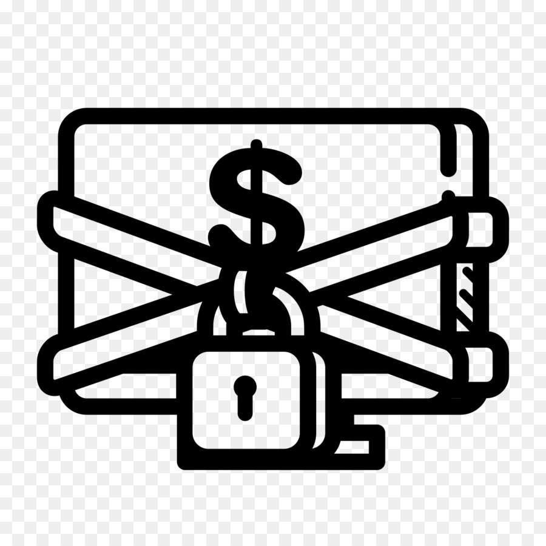

<p align="center">
  
  
  <!--  -->
  
  <a href="https://twitter.com/Flashouttt" target="_blank">
    
  </a>
</p>


<!-- PROJECT LOGO -->
<br />
<p align="center">
  <a href="https://github.com/Callumgm/Ransomware">
    
  </a>

  <h1 align="center">Cookies Ransomware</h1>

  <p align="center">
    Highly reliable, ransomware
    <br />
    <a href="#commands"><strong>All Commands »</strong></a>
    <br />
    <br />
    <a href="https://github.com/Callumgm/Ransomware/issues">Report Bug</a>
    ·
    <a href="https://github.com/Callumgm/Ransomware/issues">Request Feature</a>
    ·
    <a href="https://github.com/Callumgm/Ransomware/pulls">Send a Pull Request</a>
  </p>
</p>

<br>


## <a id="content"></a>🌐 〢 Content

- [:dart:・About](#about)
- [:white_check_mark:・Requirements](#requirements)
- [:pushpin:・Todo/Enhancements](#enhancements)
- [:thought_balloon:・Change Log](#changelog)
- [🤝・Contributing](#contributing)
- [🌟・Show your support](#support)
<!-- - [📝・License](#license) -->

## <a id="about"></a>:dart: 〢 About ##

15 🌟 Stars = Create an advanced builder used to create payloads + extensive tut on how to setup a working payload <br>
25 🌟 Stars = Make the client payload run as a undeletable backdoor inside the system32 folder


> Do not scan the client compiled exe with any antivirus software, or it will be detected and rendered useless!


This ransomware is a malware designed to deny a user or organization access to files on their computer. By encrypting these files and demanding a ransom payment for the decryption key, cyberattackers place organizations in a position where paying the ransom is the easiest and cheapest way to regain access to their files.

Have you ever heard of the WannaCry Ransomware? Well, you better lock your files or it will be gone forever! The second u run the compiled payload all files from all drives will begin to encrypt meaning i am not responsible for any damages. Once all files have been encrypted on the target machine the decryption key will be sent to your webhook. After the victim have read the README then they should proceed to contact you to pay ransom demand price.

The ransomware rage version is just like the normal ransomware except all files are instantly and permanently deleted meaning there is no possible way to get them back, only use this payload if you wish to make the victims life hell.

<br>


## <a id="requirements"></a>:white_check_mark: 〢 Requirements ##

Before starting :checkered_flag:, you are required to have [Python 3.8 - 3.9](https://www.python.org/downloads/release/python-397/) installed and [added to path](https://docs.blender.org/manual/en/latest/_images/about_contribute_install_windows_installer.png).


## <a id="enhancements"></a>:pushpin: 〢 Todo/Enhancements ##

- [ ] Create a builder for noobs
- [ ] Change pc wallpaper on encryption to message
- [ ] Be abke to choose what file extenctions to encrypt


## <a id="changelog"></a>:thought_balloon: 〢 Change Log ##

```diff
v1.0.0 ⋮ 2022-09-21
+ Initial commit
```


## <a id="contributing"></a>🤝 〢 Contributing ##
Contributions, issues and feature requests are welcome!<br />Feel free to check
[issues page](https://github.com/Callumgm/Ransomware/issues).  


## <a id="support"></a>🌟 〢 Show your support ##
Give a ⭐️ if this project helped you! 


<!-- ## <a id="license"></a>📝 〢 License ##
 Copyright © 2022
[CookiesKush420](https://github.com/Callumgm).<br />  This project is [MIT](https://github.com/Callumgm/ISO/blob/master/LICENSE) licensed. -->
